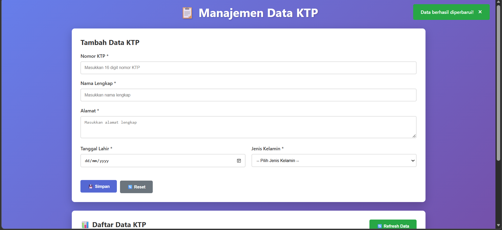

# POST
## http://localhost:8080/ktp
```json
{
  "nomorktp": "3274012501950008",
  "namalengkap": "Fio Antika",
  "alamat": "Sleman DIY",
  "tanggallahir": "2004-06-11",
  "jeniskelamin": "L"
}
```
Respon
```json
{
    "data": {
        "id": 2,
        "nomorktp": "3274012501950008",
        "namalengkap": "Fio Antika",
        "alamat": "Sleman DIY",
        "tanggallahir": "2004-06-11",
        "jeniskelamin": "L"
    },
    "success": true,
    "message": "Data KTP berhasil ditambahkan"
}
```
# PUT
## http://localhost:8080/ktp/id
```json
{
  "nomorktp": "3274012501950008",
  "namalengkap": "Fio Antika",
  "alamat": "Sumatera Barat",
  "tanggallahir": "2004-06-11",
  "jeniskelamin": "L"
}
```
Respon
```json
{
    "data": {
        "id": 2,
        "nomorktp": "3274012501950008",
        "namalengkap": "Fio Antika",
        "alamat": "Sumatera Barat",
        "tanggallahir": "2004-06-11",
        "jeniskelamin": "L"
    },
    "success": true,
    "message": "Data KTP berhasil diperbarui"
}
```
# Delete
## DELETE : http://localhost:8080/ktp/id
Respon
```json
{
    "success": true,
    "message": "Data KTP berhasil dihapus"
}
```
## Tampilan
# Input

# validasi harus 16 digit no kt

# validasi no ktp already

# Edit

# konfirmasi hapus data

# Data berhasil di hapus

